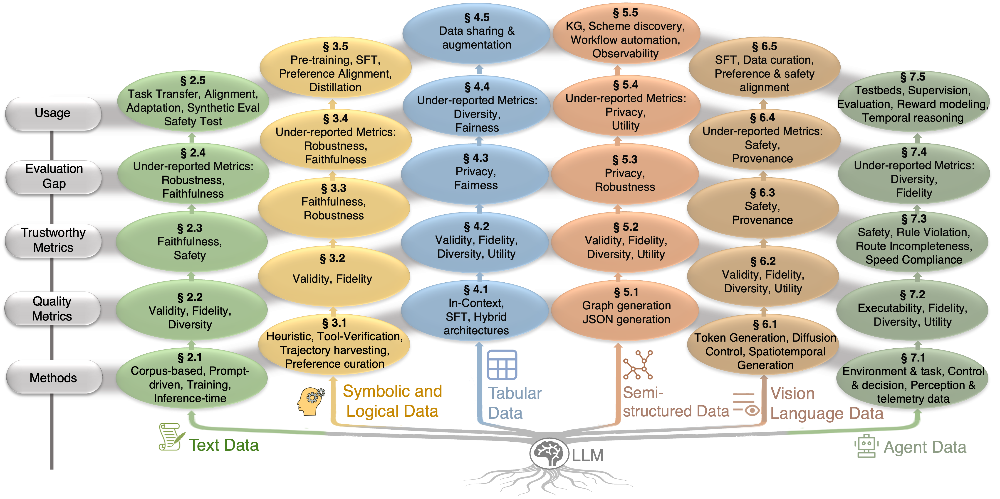

# Awesome LLM Data Generation

LLM-driven data generation is reshaping how we build training corpora, benchmarks, and evaluators across text, code, vision, and structured data. This list follows the taxonomy of *[The LLM Data Auditor: A Metric-oriented Survey on Quality and Trustworthiness in Evaluating Synthetic Data](https://arxiv.org/abs/2601.17717)* and highlights generation methods across six data modalities where LLM-driven synthetic data is advancing training, evaluation, and deployment.

  
   
  <em>Figure 1: Overview of the LLM Data Auditor Framework — four stages covering generation methods, quality metrics, trustworthy metrics, evaluation gap analysis, and data usage patterns.</em>

  
   
  <em>Figure 2: Overview of LLM-driven synthetic data generation across six modalities — text, symbolic and logical, tabular, semi-structured, vision-language, and agent data.</em>

## Table of Contents

- [Text Data](#text-data)
  - [Source Corpus Control and Composition](#source-corpus-control-and-composition)
  - [Prompt-Driven Generation and Refinement](#prompt-driven-generation-and-refinement)
  - [Parameter-Efficient and Alignment-Based Control](#parameter-efficient-and-alignment-based-control)
  - [Inference-Time Steering and Verification](#inference-time-steering-and-verification)
- [Symbolic and Logical Data](#symbolic-and-logical-data)
  - [Heuristic Evolution Methods for Expanding Reasoning Tasks](#heuristic-evolution-methods-for-expanding-reasoning-tasks)
  - [Tool-Verified Generation Methods](#tool-verified-generation-methods)
  - [Trajectory Harvesting via Rewarded Rollouts and Distillation](#trajectory-harvesting-via-rewarded-rollouts-and-distillation)
  - [Preference-Curated Generation via LLM as a Judge](#preference-curated-generation-via-llm-as-a-judge)
- [Tabular Data](#tabular-data)
  - [Prompt-Based Tabular Synthesis](#prompt-based-tabular-synthesis)
  - [Fine-Tuning-Based Tabular Synthesis](#fine-tuning-based-tabular-synthesis)
  - [Hybrid Architectures](#hybrid-architectures)
- [Semi-structured Data](#semi-structured-data)
  - [Graph Data Generation](#graph-data-generation)
  - [JSON Data Generation](#json-data-generation)
  - [Log Data Generation](#log-data-generation)
- [Vision-Language Data](#vision-language-data)
  - [Image-Text Native Autoregressive Models](#image-text-native-autoregressive-models)
  - [Image-Text External Diffusion Control](#image-text-external-diffusion-control)
  - [Video-Text Native Spatiotemporal Models](#video-text-native-spatiotemporal-models)
  - [Video-Text Planner-based Diffusion](#video-text-planner-based-diffusion)
- [Agent Data](#agent-data)
  - [Environment & Task Data](#environment--task-data)
  - [Control & Decision Data](#control--decision-data)
  - [Perception & Telemetry Data](#perception--telemetry-data)
- [Open Challenges and Future Directions](#open-challenges-and-future-directions)

## Text Data

LLM-generated instructions, dialogues, and evaluations that power instruction-tuning and benchmarking.

### Source Corpus Control and Composition

<ul>
<li><i><b>RedPajama-V2</b></i> — Web text corpus with quality-related metadata for customizable selection and mixture design.
  
  
</li>
<li><i><b>FineWeb</b></i> — Modern curation pipeline with normalization, deduplication, and document-level filtering for high-quality web text.
  
</li>
<li><i><b>FineWeb2</b></i> — Enhanced pipeline implementing transparent mixture design and quality signal processing across domains.
  
</li>
<li><i><b>Dolma</b></i> — Toolkit enabling reproducible data mixture adjustment across domains without requiring recrawling.
  
</li>
</ul>

### Prompt-Driven Generation and Refinement

<ul>
<li><i><b>Self-Instruct: Aligning Language Models with Self Generated Instructions</b></i> — Seeded prompting to grow diverse instruction–response pairs from model internal knowledge.
  
  
</li>
<li><i><b>WizardLM / Evol-Instruct</b></i> — Evolutionary mutation operators systematically rewriting instructions for increased complexity.
  
  
</li>
<li><i><b>UltraFeedback</b></i> — Pipeline evaluating outputs via auxiliary LLM judge across helpfulness and honesty criteria.
  
</li>
</ul>

### Parameter-Efficient and Alignment-Based Control

<ul>
<li><i><b>SPIN (Self-Play Fine-Tuning)</b></i> — Iterative self-play mechanism contrasting generated responses against human demonstrations.
  
  
</li>
<li><i><b>SimPO (Simple Preference Optimization)</b></i> — Reference-free objective eliminating memory-heavy reference model for direct instruction alignment.
  
  
</li>
<li><i><b>ORPO (Odds Ratio Preference Optimization)</b></i> — Method mitigating length bias without requiring separate reward modeling.
  
</li>
<li><i><b>GRPO (Group Relative Policy Optimization)</b></i> — Normalizes rewards across group outputs rather than using critic models for efficient optimization.
  
</li>
</ul>

### Inference-Time Steering and Verification

<ul>
<li><i><b>Nucleus (Top-p) Sampling</b></i> — Stochastic decoding balancing diversity and plausibility via dynamic vocabulary truncation.
  
</li>
<li><i><b>Diverse Beam Search</b></i> — Diversity-promoting penalties preventing redundancy in beam search outputs.
  
</li>
<li><i><b>JAM (Latent Activation Editing)</b></i> — Latent space interventions adjusting attributes like sentiment and safety via activation vectors.
  
</li>
<li><i><b>Chain-of-Verification (CoVe)</b></i> — Post-hoc verification where models cross-check own outputs for reliability filtering.
  
</li>
<li><i><b>RARR (Retrofit Attribution using Research and Revision)</b></i> — Framework revising drafts via retrieved evidence comparison for hallucination mitigation.
  
</li>
<li><i><b>SelfCheckGPT</b></i> — Consistency sampling detecting likely hallucinated content via multiple generations.
  
</li>
</ul>

## Symbolic and Logical Data

Math, program synthesis, and formal reasoning datasets crafted or expanded by LLMs, often paired with verifier loops.

### Heuristic Evolution Methods for Expanding Reasoning Tasks

<ul>
<li><i><b>WizardMath</b></i> — Evol-Instruct applied to math with reinforcement learning from evolution feedback to strengthen step-by-step reasoning.
  
  
</li>
<li><i><b>MetaMathQA</b></i> — Scales mathematics corpora by diversifying questions, answers, and reasoning paths via GPT-4 rewrites.
  
  
</li>
<li><i><b>WizardCoder</b></i> — Adapts instruction evolution to coding tasks by generating progressively harder instructions from simpler seeds.
  
  
</li>
</ul>

### Tool-Verified Generation Methods

<ul>
<li><i><b>OpenMathInstruct-1</b></i> — Large-scale math problem–solution pairs synthesized with code interpreter verification for consistency.
  
</li>
<li><i><b>OpenCodeInstruct</b></i> — Code instruction tuning corpora with execution feedback and unit test signals as acceptance criteria.
  
</li>
<li><i><b>ProofWriter</b></i> — Instances with validity grounded in formal rules enabling deterministic checking of entailment and proof steps.
  
</li>
<li><i><b>SynLogic</b></i> — Diverse logical tasks whose correctness can be verified by simple rule-based checkers.
  
</li>
<li><i><b>ALT / FLD</b></i> — Formal logic deduction dataset enabling deterministic verification of symbolic reasoning steps.
  
</li>
</ul>

### Trajectory Harvesting via Rewarded Rollouts and Distillation

<ul>
<li><i><b>DeepSeek R1</b></i> — Rule-based and verifiable outcome rewards providing precise feedback for mathematics and coding domains.
  
  
</li>
</ul>

### Preference-Curated Generation via LLM as a Judge

<ul>
<li><i><b>STaR (Self-Taught Reasoner)</b></i> — Generate-and-filter reasoning loops where correctness serves as the acceptance signal for rationale curation.
  
</li>
<li><i><b>Code-UltraFeedback</b></i> — Preference curation for programming via judges assessing candidate solutions on coding quality dimensions.
  
</li>
</ul>

## Tabular Data

LLM-synthesized structured tables used for privacy-preserving sharing, simulation, and downstream modeling; evaluation focuses on fidelity, privacy, and utility trade-offs.

### Prompt-Based Tabular Synthesis

<ul>
<li><i><b>CLLM</b></i> — Prompt/ICL-based tabular synthesis with confidence-aware filtering for low-data regimes.
  
</li>
<li><i><b>EPIC</b></i> — Prompts targeted at minority and long-tail slices to balance generated tables.
  
</li>
<li><i><b>LITO</b></i> — Group-specific prompting for rare-class tabular synthesis.
  
</li>
<li><i><b>TabGen-ICL</b></i> — In-context learning framework for tabular data synthesis with few-shot exemplars.
  
</li>
<li><i><b>OCTree</b></i> — LLM-based optimized feature generation for tabular data using decision tree reasoning as feedback.
  
</li>
</ul>

### Fine-Tuning-Based Tabular Synthesis

<ul>
<li><i><b>GReaT</b></i> — Fine-tuned language model serializing tabular rows as natural language for realistic data generation.
  
</li>
<li><i><b>HARMONIC</b></i> — Fine-tuning method for harmonized tabular synthesis with improved mixed-type fidelity.
  
</li>
<li><i><b>TableDreamer</b></i> — Fine-tuning-based tabular data generation with enhanced column correlation modeling.
  
</li>
<li><i><b>Table-LLM-Specialist</b></i> — Specialized LLM fine-tuning for structured table generation tasks.
  
</li>
</ul>

### Hybrid Architectures

<ul>
<li><i><b>AIGT</b></i> — Hybrid architecture combining table-to-text and text-to-table transformations for bidirectional synthesis.
  
</li>
<li><i><b>gTBLS</b></i> — Hybrid LLM and tabular architecture combining generative and discriminative approaches.
  
</li>
</ul>

## Semi-structured Data

Graph, JSON, and log-style corpora generated or expanded with LLMs for tool-use, API grounding, and graph reasoning.

### Graph Data Generation

<ul>
<li><i><b>LLM4GraphGen</b></i> — GPT-4 prompts generate node–edge lists and graph rewrites without tuning.
  
</li>
<li><i><b>GoG (Generate-on-Graph)</b></i> — LLM-based graph generation framework leveraging graph structure for guided synthesis.
  
</li>
<li><i><b>Ontology-grounded KG Generation</b></i> — Knowledge graph generation grounded in ontological constraints for structural coherence.
  
</li>
<li><i><b>GraphJudge</b></i> — Judge-based approach for graph quality validation and filtering of generated structures.
  
</li>
<li><i><b>GAG</b></i> — Multi-agent planner/evaluator ensemble to improve structural coherence of generated graphs.
  
</li>
<li><i><b>GraphMaster</b></i> — Planner–critic agents fine-tuned to evaluate and filter generated triples.
  
</li>
</ul>

### JSON Data Generation

<ul>
<li><i><b>Outlines</b></i> — Framework for structured JSON output enforcement via grammar-constrained decoding.
  
  
</li>
<li><i><b>SchemaBench</b></i> — Benchmark and reinforcement learning methods for schema-compliant JSON generation.
  
</li>
<li><i><b>LM Format Enforcer</b></i> — Ensures LLM outputs conform to JSON schema specifications at decoding time.
  
</li>
</ul>

### Log Data Generation

<ul>
<li><i><b>LogBench</b></i> — Benchmark for structured log generation and analysis with LLMs.
  
</li>
<li><i><b>AUCAD</b></i> — Log anomaly detection enhanced with LLM-synthesized augmentation data.
  
</li>
</ul>

## Vision-Language Data

Image–text and video–text synthetic pairs for multimodal instruction tuning and evaluation.

### Image-Text Native Autoregressive Models

<ul>
<li><i><b>Emu</b></i> — Unified multimodal LM that generates image–text tokens jointly for captioning and editing.
  
</li>
<li><i><b>Emu3</b></i> — Enhanced vision-language model with improved visual tokenization for unified multimodal generation.
  
</li>
<li><i><b>Chameleon</b></i> — Native autoregressive model for unified multimodal generation across text and images.
  
</li>
</ul>

### Image-Text External Diffusion Control

<ul>
<li><i><b>Kosmos-G</b></i> — Diffusion-based image generation with grounded language-visual alignment for compositional control.
  
</li>
<li><i><b>GILL</b></i> — Grounded image–language learning enabling interleaved text-and-image generation from frozen LLMs.
  
</li>
</ul>

### Video-Text Native Spatiotemporal Models

<ul>
<li><i><b>VideoPoet</b></i> — Native spatiotemporal autoregressive video generation from text and image prompts.
  
</li>
</ul>

### Video-Text Planner-based Diffusion

<ul>
<li><i><b>FlowZero</b></i> — LLM plans storyboard-like shot sequences to guide video diffusion models.
  
</li>
<li><i><b>LVD (LLM-grounded Video Diffusion)</b></i> — Structured plans from LLMs steer latent video diffusion generation.
  
</li>
<li><i><b>VideoDirectorGPT</b></i> — LLM produces shot lists and camera cues for diffusion-based video synthesis.
  
</li>
</ul>

## Agent Data

Interactive trajectories and scenarios produced with LLMs to train or benchmark agents in digital and embodied environments.

### Environment & Task Data

<ul>
<li><i><b>ChatSUMO</b></i> — LLM-driven conversational traffic scenario generation for autonomous driving simulation.
  
</li>
<li><i><b>AutoScenario</b></i> — Automated scenario generation for autonomous driving evaluation and testing.
  
</li>
<li><i><b>TTSG</b></i> — Task and trajectory scenario generation for training embodied agents.
  
  
</li>
<li><i><b>L3M+P</b></i> — Language-guided embodied agent planning and trajectory generation with LLM integration.
  
</li>
<li><i><b>SELP</b></i> — Safe and efficient task plans via LLM-generated temporal logic with equivalence voting.
  
  
</li>
<li><i><b>T3 Planner</b></i> — Task, trajectory, and test planning system for embodied agent evaluation.
  
  
</li>
<li><i><b>PARTNR</b></i> — Procedurally generated multi-agent scenarios for training collaborative agents.
  
  
</li>
</ul>

### Control & Decision Data

<ul>
<li><i><b>Grid-Agent</b></i> — Grid-world agent trajectory generation for systematic decision-making evaluation.
  
</li>
<li><i><b>Twin-2K-500</b></i> — Digital twin synthetic control and decision dataset for agent benchmarking.
  
</li>
<li><i><b>BehaviorChain</b></i> — Behavioral chain-of-thought for generating structured agent trajectories.
  
  
</li>
<li><i><b>LLM Trainer</b></i> — LLM-based training data generation for robotic control policies.
  
</li>
<li><i><b>ELLMER</b></i> — Embodied LLM learning with merging and refining for manipulation task trajectories.
  
  
</li>
<li><i><b>Instruct2Act</b></i> — Instruction-guided action synthesis for robotic manipulation via LLM code generation.
  
  
</li>
<li><i><b>ProgPrompt</b></i> — Programmatic prompting generating robot action plans from natural language instructions.
  
  
</li>
</ul>

### Perception & Telemetry Data

<ul>
<li><i><b>DefectTwin</b></i> — Synthetic defect detection data via digital twins and LLM-guided augmentation.
  
  
</li>
<li><i><b>SceneCraft</b></i> — LLM-guided 3D scene layout synthesis for perception training data generation.
  
</li>
<li><i><b>BlenderLLM</b></i> — Blender-based synthetic perception data generation with LLM guidance for 3D scene understanding.
  
  
</li>
</ul>

## Open Challenges and Future Directions

Open problems around metric robustness, trust–utility trade-offs, dynamic data curation, and standardized reporting for LLM-generated corpora. Key areas identified by the survey include evaluation practice gaps across all six modalities, under-reported metrics for fairness, robustness, and faithfulness, and the need for unified quality and trustworthiness frameworks that go beyond downstream task performance.
